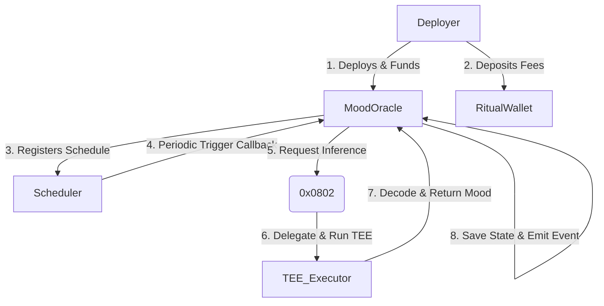

# Mood Oracle: Autonomous AI Oracle on Ritual Chain

Mood Oracle is an autonomous state-updating AI prediction oracle built natively on **Ritual Chain** (EVM Chain ID `1979`). It utilizes Ritual's on-chain **Scheduler** for automated trigger operations and executes LLM inference securely within a Trusted Execution Environment (TEE) via the native **LLM Inference Precompile (`0x0802`)**.

---

## 🚀 Key Features

* **Autonomous Recurring Triggers:** Scheduled entirely on-chain through the native `Scheduler` contract, bypassing the need for centralized external keepers.
* **On-Chain AI Inference:** Calls the native precompile `0x0802` using the `zai-org/GLM-4.7-FP8` model within a secure TEE enclave.
* **Capital Escrow & Funding Flow:** Integrates with the `RitualWallet` contract to escrow and manage computing fees, automatically deducting tokens upon task execution.
* **Interactive Frontend Dashboard:** An elegant, glassmorphic UI visualizing current state transitions, active block schedules, and real-time TEE execution pipelines.

---

## 🛠 Project Architecture



---

## 📦 Directory Layout

```text
├── package.json                 # Monorepo workspaces setup
├── packages/
│   ├── contracts/               # Hardhat & Foundry contract project
│   │   ├── src/                 # Core Solidity files
│   │   │   ├── MoodOracle.sol   # Core oracle contract
│   │   │   └── interfaces/      # Ritual system contract interfaces
│   │   ├── scripts/             # Deployment and setup scripts
│   │   └── test/                # Local simulation and unit tests
│   └── frontend/                # Vite & React frontend dashboard
└── DEPLOYMENT_READY.md          # Complete step-by-step deployment guide
```

---

## ⚡ Quick Start

### 1. Installation
Clone the repository and install dependencies at the monorepo root:
```bash
npm install
```

### 2. Configuration
Create the environment file inside the contracts package:
```bash
cp packages/contracts/.env.example packages/contracts/.env
```
Fill in the configuration details inside `packages/contracts/.env`:
* `PRIVATE_KEY` (funded with RITUAL tokens)
* `EXECUTOR_ADDRESS` (target registered TEE executor)

### 3. Compilation
```bash
npm run compile
```

### 4. Running Tests
```bash
npm run test
```

### 5. Deployment
Deploy the oracle, fund the escrow wallet, approve the scheduler, and trigger recurring runs:
```bash
npm run deploy:ritual
```

### 6. Start Frontend
Update the contract address in `packages/frontend/src/App.tsx` and run the development server:
```bash
npm run dev
```

---

## 📜 License
This project is licensed under the MIT License - see the 
[LICENSE](LICENSE) file for details.


